# Lab3Web

### Membuat List

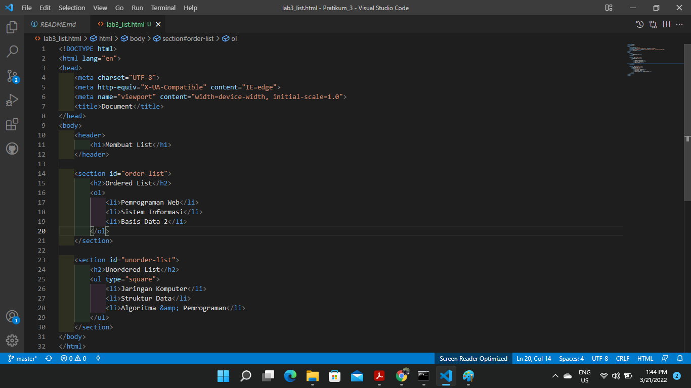
* Tag `<Header>` pada html digunakan untuk menentukan header atau kepala 
dokumen dari website atau situs html. Tag tersebut berisi informasi 
yang berkaitan dengan judul dan heading konten terkait
* tag `<section>` merepresentasikan sebuah bagian dokumen atau aplikasi.
Secara kontekstual, `<section>` element digunakan untuk mengelompokkan konten/dokumen 
menjadi beberapa bagian berdasarkan tema atau pokok pikiran masing-masing.
* tag `<ol>` (Ordered List) digunakan untuk membuat daftar dimana tiap bagiannya memiliki nomor secara terurut.
* tag `<ul>` (Unordered List) berfungsi untuk menampilkan daftar list dalam bentuk bulat
atau kotak.

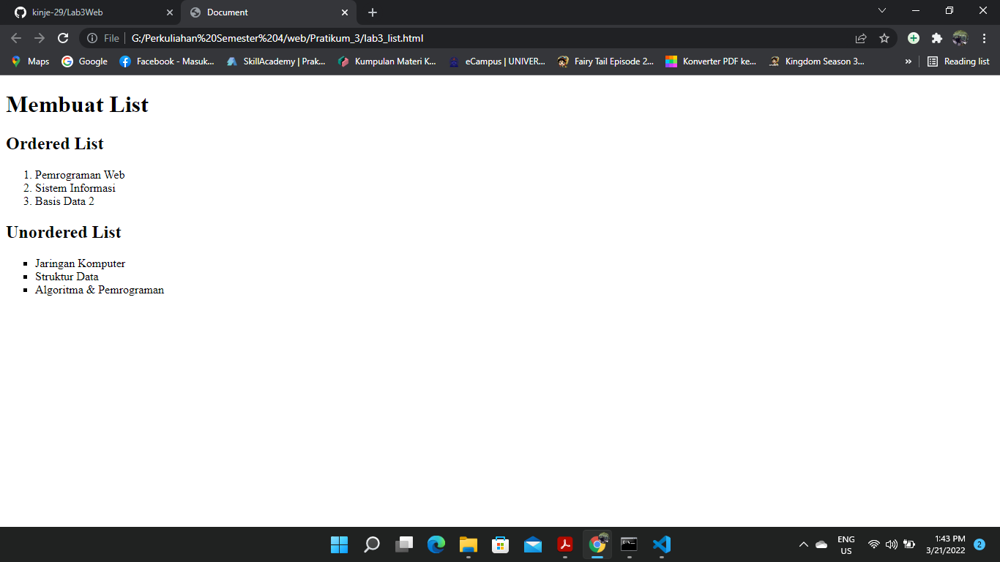

### Description List
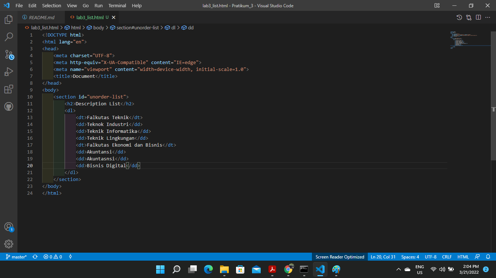
* tag `<dl>` menunjukan sebuah Description List atau daftar penjelasan.
* tag `<dt>` menunjukkan sebuah Definition Term yang digunakan untuk merepresentasikan sebuah istilah pada daftar definisi
(Definition list(`<dl>`)). `<dt>` ditulis didalam elemet `<dl>` dan sebelum `<dd>`
* tag `<dd>` menunjukan sebuah Definition Description atau penjelasan dari sebuah istilah/term.
`<dd>` tag merupakan element yang memberikan penjelasan sebuah istilah/term 
(Yang ditulis didalam element `<dt>` (definition term)). 
element `<dt>` dan `<dd>`, keduanya ditulis dalam `<dl>` element yang menunjukkan sebuah definition list.

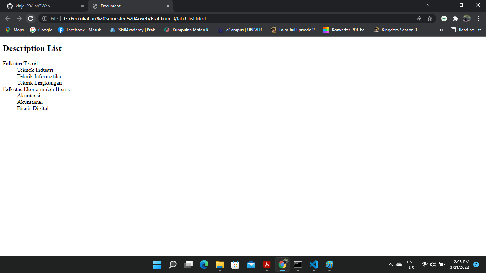

### Membuat Tabel
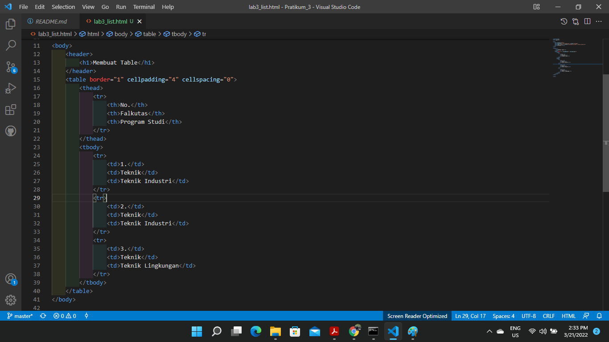
* Tag `<table>` untuk membungkus tabelnya
* Border adalah salah satu property css, border memiliki fungsi untuk memberi batas/garis(seperti) pada suatu bidang/box/tag html.
* Atribut cellpadding adalah atribut untuk mengatur jarak teks dengan garis di dalam sel.
* cellspacing digunakan untuk mengatur jarak antara garis tepi (border) bagian dalam dan luar.
* tag `<thead>` digunakan untuk mengelompokkan konten yang terletak di kepala (atas) sebuah tabel. 
Di dalam element `<thead>` tersebut, harus ditulis element `<tr>` yang menunjukkan table row atau baris sebuah table.
* Tag `<tbody>` untuk membungkus bagian body dari tabel
* Tag `<tr>` (tabel row) untuk membuat baris
* Tag `<th>` (table head) untuk membuat judul pada header
* Tag `<td>` (table data) untuk membuat sel

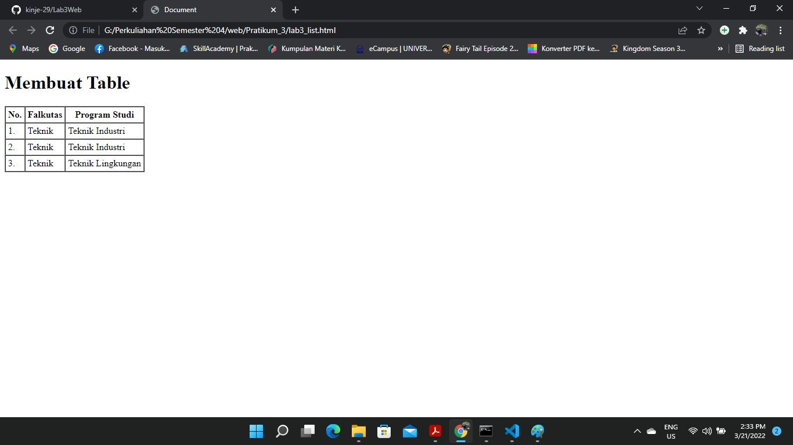

### Atribut rowspan
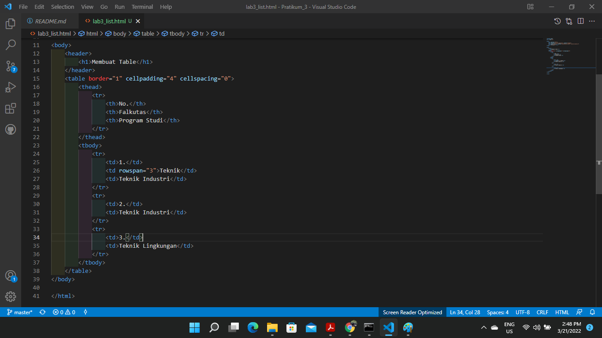
* Atribut rowspan digunakan untuk menggabungkan baris pada tabel.

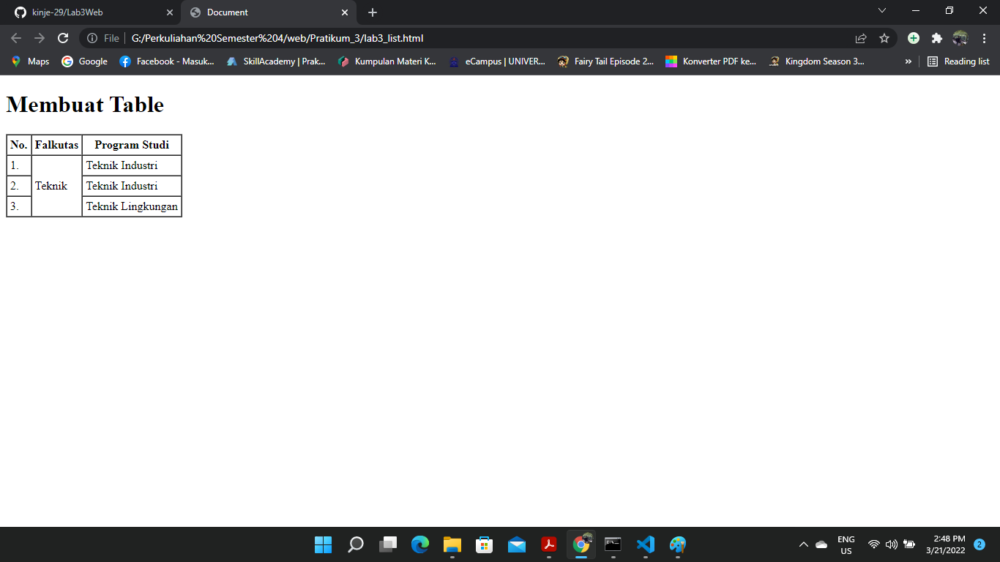

### Membuat Form
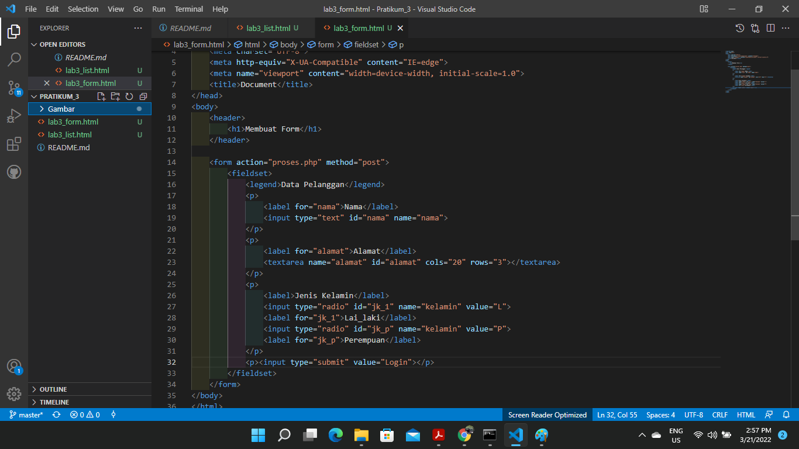
* Form merupakan bagian pada HTML yang dapat digunakan untuk membuat elemen Form pada halaman Web.
Elemen Form dapat terdiri dari check box, radio button, menu, text box, text area, dan button.
* Tag `<Legend>`, digunakan untuk memberikan judul pada sebuah form. Dengan tag `<legend> `kita dapat membedakan form – form sesuai namanya.
* Tag `<input>` Elemen input tipe teks dapat dipai untuk berbagai macam tipe data. Dapat berupa teks, nama, alamat, tanggal, nomor hp, email yang berupa sebuah teks.
* `type="text"` digunakan agar tag `<input>` itu berupa sebuah teks.
* Tag  `<textarea>` digunaka untuk mengisi huruf atau angka yang panjang, contoh seperti Alamat maka bisa menggunakan `textarea`.
* Membuat radio button isi dalam `<input type="radio">`, kegunaan radio button adalah agar pengguna untuk memilih salah satu dari radio button itu contoh 
"Jenis Kelami Laki-Laki Perempuan" maka pengguna akan memilih salah satu dari pilihan itu.
* Type `submit` digunakan untuk memproses data yang di input.

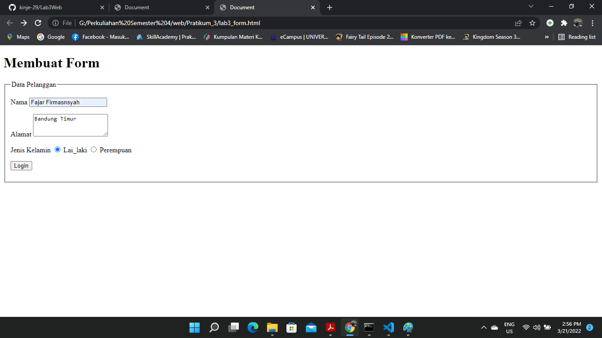

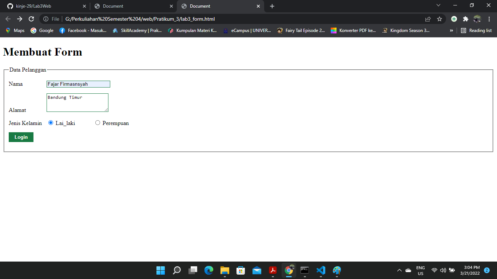
