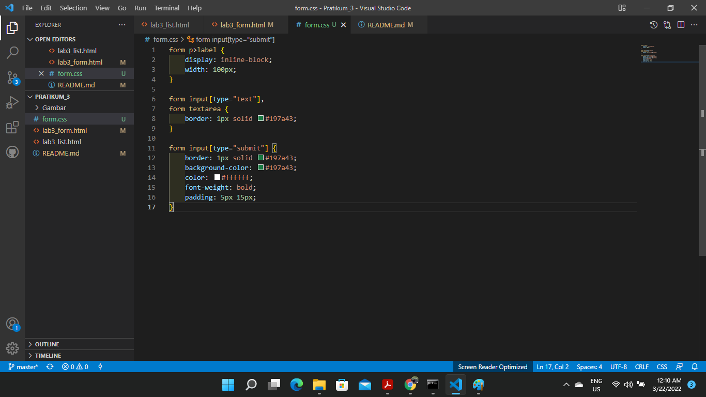

# Lab3Web

## Membuat List

        * Tag Header pada html digunakan untuk menentukan header atau kepala 
        dokumen dari website atau situs html. Tag tersebut berisi informasi 
        yang berkaitan dengan judul dan heading konten terkait

